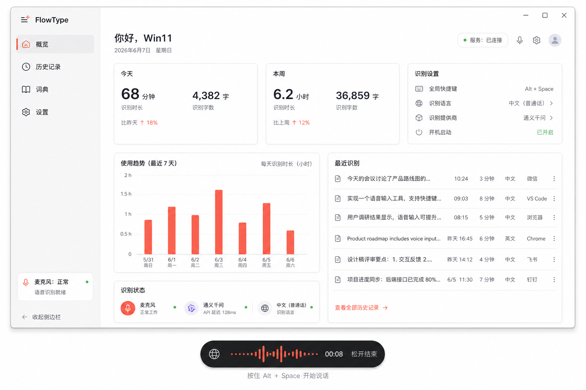
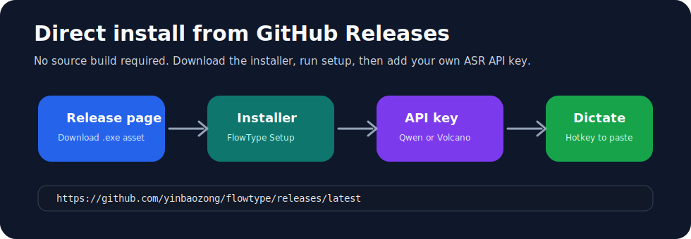
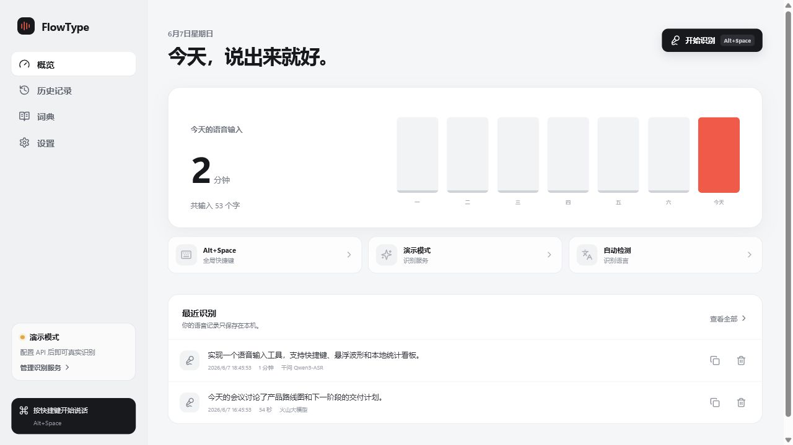
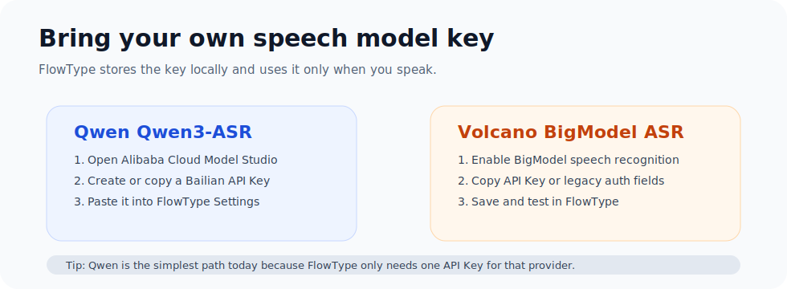

# FlowType

Press a hotkey, speak, and let text appear in the app you were already using.

FlowType is a Windows desktop voice dictation tool built with Electron, React, and TypeScript. It stays in the tray, records from a global hotkey, sends audio to a configurable speech model, then pastes the recognized text back into the original input box. Bring your own API key; your history and credentials stay local.





## Why Star This

- System-wide voice input for Windows, not just a demo inside one textbox.
- Hold-to-talk workflow: press, speak, release, paste.
- Floating recording bar with waveform feedback and draggable position.
- Works with Qwen `qwen3-asr-flash` and Volcano BigModel ASR.
- Local history, daily stats, personal dictionary, and language selection.
- API keys are stored with Electron `safeStorage` on the local Windows account.
- Ships with a full build pipeline: dev app, production build, and NSIS installer.



## The Experience

1. Put the cursor in any text field: editor, browser, chat app, notes app.
2. Hold the configured shortcut, such as `Win + Space` or `Alt + Win`.
3. Speak naturally.
4. Release the shortcut.
5. FlowType transcribes and pastes the result where your cursor was.

No cloud account is bundled with the app. Users configure their own speech API key in Settings.

## Install Without Building

Most users should install from GitHub Releases:

1. Open the latest release: https://github.com/yinbaozong/flowtype/releases/latest
2. Download `FlowType Setup 0.2.0.exe`.
3. Run the installer.
4. If Windows warns that the publisher is unknown, only continue if you trust the downloaded file.
5. Start FlowType, open Settings, and add your own speech API key.

The installer is unsigned. Windows SmartScreen or Smart App Control may warn or block it. That is normal for self-built open-source Windows installers. A public production release should be signed with a trusted code signing certificate.

## Requirements

- Windows 10/11
- Node.js 20+ or 22+
- npm
- Microphone permission for desktop apps
- A speech API key:
  - Alibaba Cloud Bailian API key for Qwen `qwen3-asr-flash`
  - or Volcano Engine BigModel speech recognition API key

## Quick Start

Clone and install:

```powershell
git clone https://github.com/yinbaozong/flowtype.git
cd flowtype
npm install
```

Run the development app:

```powershell
npm run dev
```

Build the production files:

```powershell
npm run build
```

Build the Windows installer:

```powershell
npm run dist
```

The installer is written to `release/FlowType Setup 0.2.0.exe`.

## First Setup

1. Start FlowType.
2. Open Settings.
3. Pick a provider: Demo, Qwen, or Volcano.
4. Paste your API key.
5. Click the provider test button.
6. Choose a hotkey mode.
7. Put your cursor in any text field and try a short sentence.

Demo mode is useful for checking the UI flow without calling a real provider. Real dictation requires Qwen or Volcano credentials.

## Shortcut Behavior

FlowType supports two shortcut modes:

- Hold-to-talk presets: `Win + Space` and `Alt + Win`. These use `resources/windows-key-hook.ps1`, so recording starts when the keys go down and stops when you release them.
- Custom shortcuts: capture a combination in Settings, such as `Ctrl + Alt + D`. These use Electron `globalShortcut`, so they work as a toggle: press once to start recording, press again to stop.

Current verification:

- The custom shortcut capture UI is implemented in `src/renderer/src/App.tsx`.
- Shortcut normalization and registration are implemented in `src/main/index.ts`.
- `npm run typecheck`, `npm run build`, and `npm run dist` pass on Windows.
- Manual OS-level shortcut behavior should still be checked on the target Windows machine because global shortcuts can be blocked by other apps or reserved by Windows.

## Get An API Key



### Option A: Alibaba Cloud Bailian / Qwen

This is the simplest path because FlowType only needs one API key.

1. Open Alibaba Cloud Model Studio / Bailian: https://bailian.console.aliyun.com/
2. Sign in with an Alibaba Cloud account.
3. Activate Bailian / Model Studio if the console asks you to enable the service.
4. Open API Key management. In many accounts this is shown as `API-KEY`, `API Key`, or `API Key 管理`.
5. Create a new API key.
6. Copy the key once and keep it private.
7. In FlowType Settings, choose `千问 Qwen3-ASR`.
8. Paste the key into `千问 API Key`.
9. Click `保存并测试当前识别服务`.

FlowType calls Qwen `qwen3-asr-flash` through the DashScope-compatible endpoint. Alibaba's Qwen-ASR API reference lists `qwen3-asr-flash` as supporting OpenAI-compatible and DashScope synchronous calls, and its examples use `Authorization: Bearer $DASHSCOPE_API_KEY`.

Official references:

- Get API Key: https://help.aliyun.com/zh/model-studio/get-api-key
- Qwen-ASR API: https://help.aliyun.com/zh/model-studio/qwen-asr-api-reference

### Option B: Volcano Engine BigModel ASR

Use this if you already have Volcano Engine speech recognition enabled.

1. Open Volcano Engine and sign in: https://www.volcengine.com/
2. Enter the speech / audio technology console.
3. Enable BigModel speech recognition if it is not already enabled.
4. Find the API credential section for BigModel ASR.
5. Prefer the modern API Key credential if your console provides one.
6. In FlowType Settings, choose `火山大模型`.
7. Paste that value into `火山 API Key`.
8. Leave `火山 App ID` and `火山 Access Key` empty unless your console gives you the older App Key + Access Key style credentials.
9. Click `保存并测试当前识别服务`.

FlowType calls `https://openspeech.bytedance.com/api/v3/auc/bigmodel/recognize/flash` with resource id `volc.bigasr.auc_turbo`.

Official references:

- Authentication: https://www.volcengine.com/docs/6561/107789
- BigModel recording recognition: https://www.volcengine.com/docs/6561/1354868

## Data And Privacy

FlowType stores app data on the current Windows user account:

```text
%APPDATA%\FlowType
```

During local development, data is stored under the project-local `.flowtype-data/` folder. Both locations are ignored by Git.

API keys are encrypted with Electron `safeStorage` when Windows encryption is available. The repository does not contain API keys, usage history, or user recordings.

## Architecture

```text
src/main/        Electron main process, tray, global hotkey, provider calls, paste flow
src/preload/     Safe bridge exposed to the renderer
src/renderer/    React app, settings, history, overlay UI
src/shared/      Shared TypeScript types
resources/       Windows hotkey hook script and icons
docs/            Screenshots and user-facing notes
```

The global shortcut is handled by a PowerShell/C# low-level keyboard hook in `resources/windows-key-hook.ps1`. The renderer records audio, the main process calls the selected ASR provider, then FlowType restores focus and pastes the recognized text.

## Verification

These commands are expected to pass before publishing changes:

```powershell
npm run typecheck
npm run build
npm run dist
```

Current local verification:

- `typecheck`: passed
- `build`: passed
- `dist`: passed and generated an unsigned NSIS installer

## Important Windows Note

The generated installer is unsigned. Windows SmartScreen or Smart App Control may warn or block it. This is expected for self-built open-source installers. Public distribution should use a trusted code signing certificate.

For development, `npm run dev` is the fastest way to run and inspect the app.

## Roadmap Ideas

- Streaming transcription with WebSocket providers
- More OpenAI-compatible speech providers
- Better punctuation and post-processing presets
- Import/export for personal dictionary
- Signed release builds
