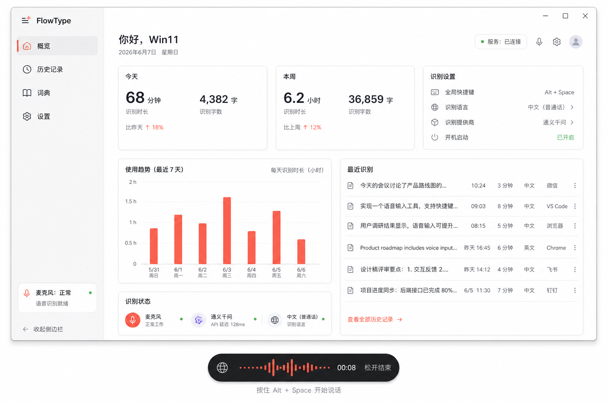
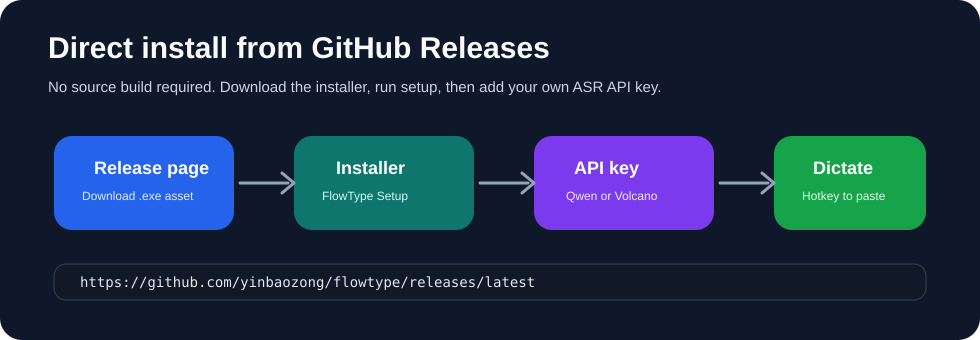
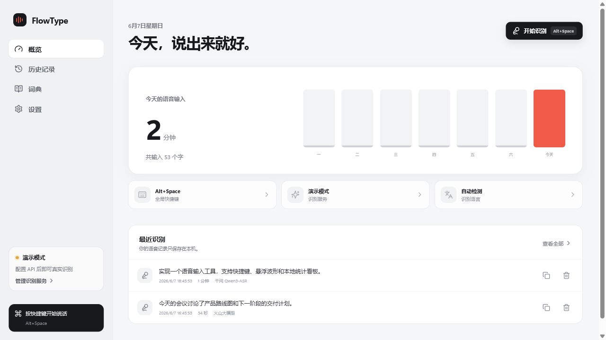
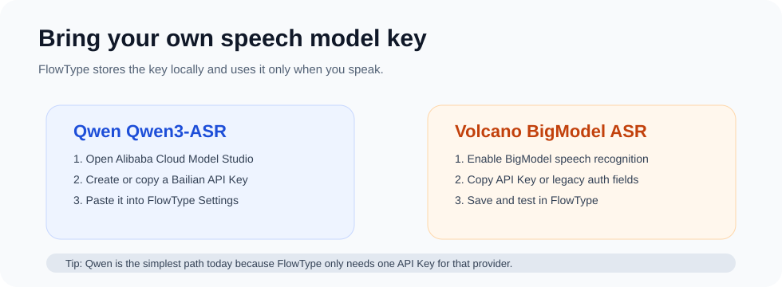

# FlowType

[English](README.md) | [简体中文](README.zh-CN.md)

Press a hotkey, speak, and let text appear in the app you were already using.

FlowType is a Windows desktop voice dictation tool built with Electron, React, and TypeScript. It stays in the tray, records from a global hotkey, sends audio to a configurable speech model, then pastes the recognized text back into the original input box. Bring your own API key; your history and credentials stay local.





## Why Star This

- System-wide voice input for Windows, not just a demo inside one textbox.
- Hold-to-talk workflow: press, speak, release, paste.
- Floating recording bar with waveform feedback and draggable position.
- Native custom shortcut capture with hold-to-talk behavior for every supported combination.
- Works with Qwen `qwen3-asr-flash` and Volcano BigModel ASR.
- Local history with Markdown export, daily stats, personal dictionary, and language selection.
- API keys are stored with Electron `safeStorage` on the local Windows account.
- Ships with a full build pipeline: dev app, production build, and NSIS installer.



## The Experience

1. Put the cursor in any text field: editor, browser, chat app, notes app.
2. Hold the configured shortcut, such as `Win + Space` or `Alt + Win`.
3. Speak naturally.
4. Release the shortcut.
5. FlowType transcribes and pastes the result where your cursor was.

No cloud account is bundled with the app. Users configure their own speech API key in Settings.

## Install Without Building

Most users should install from GitHub Releases:

1. Open the latest release: https://github.com/yinbaozong/flowtype/releases/latest
2. On a PC with Smart App Control enabled, download `FlowType.Portable.0.3.2.zip`, extract the complete folder, and run `FlowType.exe`.
3. On other PCs, you can use the unsigned `FlowType.Setup.0.3.1.exe` installer, but Windows may block it.
4. If Windows warns that the publisher is unknown, only continue if you trust the downloaded file.
5. Start FlowType, open Settings, and add your own speech API key.

The portable build does not modify the registry. Remove its extracted folder to uninstall it; settings and history remain under `%APPDATA%\FlowType` unless removed manually. The NSIS installer creates `Uninstall FlowType.exe` in the selected installation directory.

The installer is unsigned. Windows SmartScreen or Smart App Control may warn or block it. That is normal for self-built open-source Windows installers. A public production release should be signed with a trusted code signing certificate.

## Need Help?

If you want to reproduce this project but are not sure how to start, feel free to contact me anytime: yinbaozong@163.com

## Requirements

- Windows 10/11
- Node.js 20+ or 22+
- npm
- Microphone permission for desktop apps
- A speech API key:
  - Alibaba Cloud Bailian API key for Qwen `qwen3-asr-flash`
  - or Volcano Engine BigModel speech recognition API key

## Quick Start

Clone and install:

```powershell
git clone https://github.com/yinbaozong/flowtype.git
cd flowtype
npm install
```

Run the development app:

```powershell
npm run dev
```

Build the production files:

```powershell
npm run build
```

Build the Windows installer:

```powershell
npm run dist
```

Build the Smart App Control-compatible portable archive used for local unsigned distribution:

```powershell
npm run dist:portable
```

The portable archive is written to `release/FlowType Portable 0.3.2.zip`. It keeps the original Electron executable byte-for-byte and packages FlowType in the adjacent `resources/app.asar` file.

## First Setup

1. Start FlowType.
2. Open Settings.
3. Pick a provider: Demo, Qwen, or Volcano.
4. Paste your API key.
5. Click the provider test button.
6. Choose a hotkey mode.
7. Put your cursor in any text field and try a short sentence.

Demo mode is useful for checking the UI flow without calling a real provider. Real dictation requires Qwen or Volcano credentials.

## Shortcut Behavior

FlowType uses the same hold-to-talk behavior for presets and custom shortcuts:

- Open Settings and click `录入新快捷键`.
- Press a combination such as `Alt + Win`, `Win + Space`, or `Ctrl + Alt + D`.
- Hold the combination to record. Releasing any key ends recording and starts recognition.
- Windows-reserved combinations such as `Ctrl + Alt + Delete`, `Alt + Tab`, and `Win + L` are rejected.

Shortcut capture and runtime detection both use a Windows low-level keyboard hook. The hook suppresses the configured combination and releases modifier state after recording, preventing the Start menu, input-language switcher, or stuck Win/Alt/Ctrl keys.

## Migrate Development Data

If you previously ran FlowType from the repository with Electron, its data is stored in `.flowtype-data`, while the installed app uses `%APPDATA%\FlowType`. Close FlowType and run `scripts/migrate-development-data.ps1 -InstalledApp 'C:\path\to\FlowType.exe' -RemoveDevelopmentData` to back up both files, merge history by ID, preserve current installed settings, and remove only the old development data and shortcuts.

Current verification:

- Native shortcut capture is implemented in `resources/shortcut-capture.ps1`.
- Hold-to-talk detection is implemented in `resources/windows-key-hook.ps1`.
- Run `npm run verify:hotkeys` to test `Alt + Win`, `Win + Space`, and `Ctrl + Alt + D` with injected Windows key events.
- `npm run typecheck`, `npm run build`, and `npm run dist` pass on Windows.
- Manual OS-level shortcut behavior should still be checked on the target Windows machine because global shortcuts can be blocked by other apps or reserved by Windows.

## Get An API Key



### Option A: Alibaba Cloud Bailian / Qwen

This is the simplest path because FlowType only needs one API key.

1. Open Alibaba Cloud Model Studio / Bailian: https://bailian.console.aliyun.com/
2. Sign in with an Alibaba Cloud account.
3. Activate Bailian / Model Studio if the console asks you to enable the service.
4. Open API Key management. In many accounts this is shown as `API-KEY`, `API Key`, or `API Key 管理`.
5. Create a new API key.
6. Copy the key once and keep it private.
7. In FlowType Settings, choose `千问 Qwen3-ASR`.
8. Paste the key into `千问 API Key`.
9. Click `保存并测试当前识别服务`.

FlowType calls Qwen `qwen3-asr-flash` through the DashScope-compatible endpoint. Alibaba's Qwen-ASR API reference lists `qwen3-asr-flash` as supporting OpenAI-compatible and DashScope synchronous calls, and its examples use `Authorization: Bearer $DASHSCOPE_API_KEY`.

Official references:

- Get API Key: https://help.aliyun.com/zh/model-studio/get-api-key
- Qwen-ASR API: https://help.aliyun.com/zh/model-studio/qwen-asr-api-reference

### Option B: Volcano Engine BigModel ASR

Use this if you already have Volcano Engine speech recognition enabled.

1. Open Volcano Engine and sign in: https://www.volcengine.com/
2. Enter the speech / audio technology console.
3. Enable BigModel speech recognition if it is not already enabled.
4. Find the API credential section for BigModel ASR.
5. Prefer the modern API Key credential if your console provides one.
6. In FlowType Settings, choose `火山大模型`.
7. Paste that value into `火山 API Key`.
8. Leave `火山 App ID` and `火山 Access Key` empty unless your console gives you the older App Key + Access Key style credentials.
9. Click `保存并测试当前识别服务`.

FlowType calls `https://openspeech.bytedance.com/api/v3/auc/bigmodel/recognize/flash` with resource id `volc.bigasr.auc_turbo`.

Official references:

- Authentication: https://www.volcengine.com/docs/6561/107789
- BigModel recording recognition: https://www.volcengine.com/docs/6561/1354868

## Data And Privacy

FlowType stores app data on the current Windows user account:

```text
%APPDATA%\FlowType
```

During local development, data is stored under the project-local `.flowtype-data/` folder. Both locations are ignored by Git.

API keys are encrypted with Electron `safeStorage` when Windows encryption is available. The repository does not contain API keys, usage history, or user recordings.

## Export Recognition History

Open `历史记录` and click `导出 Markdown`. FlowType exports every successful recognition entry with its timestamp, speech model, recording duration, and recognized text. Failed or empty recognition attempts are not included.

## Architecture

```text
src/main/        Electron main process, tray, global hotkey, provider calls, paste flow
src/preload/     Safe bridge exposed to the renderer
src/renderer/    React app, settings, history, overlay UI
src/shared/      Shared TypeScript types
resources/       Windows hotkey hook script and icons
docs/            Screenshots and user-facing notes
```

The global shortcut is captured and handled by PowerShell/C# low-level keyboard hooks in `resources/shortcut-capture.ps1` and `resources/windows-key-hook.ps1`. The renderer records audio, the main process calls the selected ASR provider, then FlowType restores focus and pastes the recognized text. On Windows, the floating overlay uses a native shaped-window region so pixels outside the pill cannot be drawn, preventing transparent-window rectangles and shadows.

## Verification

These commands are expected to pass before publishing changes:

```powershell
npm run typecheck
npm run verify:hotkeys
npm run verify:overlay
npm run build
npm run dist
```

Current local verification:

- `verify:hotkeys`: validates native capture, hold/release events, and modifier cleanup
- `verify:overlay`: validates the native pill-shaped window region and confirms outside pixels are clipped

## Important Windows Note

The generated installer is unsigned. Windows SmartScreen or Smart App Control may warn or block it. This is expected for self-built open-source installers. Public distribution should use a trusted code signing certificate.

### Code signing

Code signing attaches a publisher identity and an integrity signature to the installer and executable. Users can verify who published the file and Windows can detect changes made after signing. For public distribution, obtain an OV/EV code-signing certificate or use Microsoft Artifact Signing, configure the certificate for `electron-builder`, and add an RFC 3161 timestamp. A self-signed certificate does not remove SmartScreen warnings for other users.

For a standard PFX code-signing certificate, keep the certificate outside the repository and build from a private terminal or CI secret:

```powershell
$env:CSC_LINK = 'C:\secure\publisher-certificate.pfx'
$env:CSC_KEY_PASSWORD = 'certificate-password'
npm run dist:signed
```

`electron-builder` will sign the packaged executable, installer, and generated uninstaller when the certificate is available. The signed build machine must allow creation of symbolic links (enable Windows Developer Mode or run the build terminal as administrator). Never commit the PFX file or password.

- Microsoft SmartScreen reputation: https://learn.microsoft.com/windows/apps/package-and-deploy/smartscreen-reputation
- Microsoft SignTool guide: https://learn.microsoft.com/windows/win32/seccrypto/signtool

For development, `npm run dev` is the fastest way to run and inspect the app.

## Roadmap Ideas

- Streaming transcription with WebSocket providers
- More OpenAI-compatible speech providers
- Better punctuation and post-processing presets
- Import/export for personal dictionary
- Signed release builds
