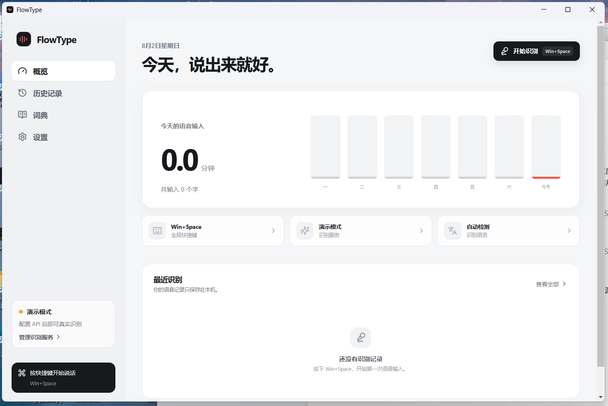

# FlowType

[English](README.md) | [简体中文](README.zh-CN.md)

按住快捷键说话，松开后，识别结果会自动输入到原来正在使用的输入框中。

FlowType 是一款使用 Electron、React 和 TypeScript 开发的 Windows 桌面语音输入工具。它平时驻留在系统托盘，通过全局快捷键录音，调用用户自己配置的语音识别模型，并把识别文字粘贴回原输入位置。API Key、历史记录和个人设置均保存在本机。



## 主要功能

- 在浏览器、微信、编辑器和笔记软件等 Windows 应用中进行语音输入。
- 按住组合键开始录音，松开任意组成键结束录音并识别。
- 支持录入自定义组合快捷键，例如 `Alt + Win`、`Win + Space`、`Ctrl + Alt + D`。
- 支持单独配置撤销快捷键，一次撤回 FlowType 最近输入的整段文字。
- 带实时波形反馈的悬浮录音条，可拖动并调整大小。
- 使用系统原生窗口拖拽，并支持在设置或托盘菜单中隐藏、恢复悬浮条。
- 支持千问 `qwen3-asr-flash` 和火山大模型语音识别。
- 提供本地历史记录、每日统计、个人词典和 Markdown 导出。
- 整个应用界面可在简体中文和 English 之间切换。
- 使用 Electron `safeStorage` 加密保存当前 Windows 账户下的 API Key。

## 下载与安装

普通用户不需要安装 Node.js，也不需要编译源代码：

1. 打开 [GitHub 最新版本](https://github.com/yinbaozong/flowtype/releases/latest)。
2. 同一个 `v0.5.1` Release 中同时提供两种文件。
3. 免安装版：下载 `FlowType.Portable.0.5.1.zip`，完整解压到固定文件夹，再运行 `FlowType.exe`。
4. 安装版：下载 `FlowType.Setup.0.5.1.exe`，运行后选择安装位置。
5. 启动 FlowType，在设置页配置语音识别服务、API Key 和快捷键。

免安装版不会修改注册表，删除解压目录即可卸载。安装版会在安装目录中生成 `Uninstall FlowType.exe`。两种版本共用 `%APPDATA%\FlowType` 中的设置和历史记录，因此升级或更换程序目录不会自动删除个人数据。

当前发布文件未使用受信任的商业代码签名证书。Windows SmartScreen 可能警告，开启 Smart App Control 的电脑也可能拦截安装版。此时优先使用完整解压后的 ZIP 免安装版，并且只运行自己信任来源的文件。

## 使用方式

1. 在任意软件中点击一个输入框。
2. 按住配置好的快捷键。
3. 正常说话。
4. 松开快捷键。
5. FlowType 完成识别，并把文字输入到原输入框。

## 首次配置

1. 打开“设置”。
2. 选择“演示模式”“千问”或“火山大模型”。
3. 填入相应的 API Key。
4. 点击“保存并测试当前识别服务”。
5. 点击“录入新快捷键”，同时按下想使用的组合键。
6. 在“界面语言”中选择中文或 English。
7. 在任意输入框中测试一句简短语音。

演示模式只用于检查界面和输入流程，不会调用真实识别服务。正式使用需要配置千问或火山凭证。

## 自定义快捷键

快捷键录入和运行时检测都使用 Windows 低级键盘钩子：

- 支持 `Alt + Win`、`Win + Space`、`Ctrl + Alt + D` 等组合。
- 按住全部组成键开始录音，松开其中任意一个键结束录音。
- 保存后立即生效，重新启动 FlowType 后仍然有效。
- `Ctrl + Alt + Delete`、`Alt + Tab`、`Win + L` 等 Windows 保留组合会被拒绝。
- FlowType 会拦截已配置的组合并清理修饰键状态，避免开始菜单、输入法切换窗口或 Win/Alt/Ctrl 卡住。

## 导出语音记录

打开“历史记录”，点击“导出 Markdown”并选择保存位置。导出文件只包含识别成功且有文字的记录，每条记录包含识别时间、使用模型、录音时长和识别文字。

## 配置 API Key

### 千问 Qwen3-ASR

1. 打开[阿里云百炼控制台](https://bailian.console.aliyun.com/)并登录。
2. 开通模型服务并进入 API Key 管理。
3. 创建 API Key，在 FlowType 中选择“千问 Qwen3-ASR”。
4. 填入 Key，点击“保存并测试当前识别服务”。

官方资料：[获取 API Key](https://help.aliyun.com/zh/model-studio/get-api-key) | [Qwen-ASR API](https://help.aliyun.com/zh/model-studio/qwen-asr-api-reference)

### 火山大模型语音识别

1. 打开[火山引擎控制台](https://www.volcengine.com/)并登录。
2. 开通大模型语音识别并取得凭证。
3. 在 FlowType 中选择“火山大模型”，填入 API Key。
4. 只有控制台提供旧式 App ID 和 Access Key 时，才填写对应字段。
5. 点击“保存并测试当前识别服务”。

官方资料：[鉴权方法](https://www.volcengine.com/docs/6561/107789) | [大模型录音文件识别](https://www.volcengine.com/docs/6561/1354868)

## 数据与隐私

正式版本的数据位于：

```text
%APPDATA%\FlowType
```

从源代码运行开发版时，数据保存在项目目录的 `.flowtype-data/` 中。API Key 会在 Windows 支持时使用 Electron `safeStorage` 加密。GitHub 仓库不包含用户的 API Key、语音历史或录音文件。

## 从源代码运行

```powershell
git clone https://github.com/yinbaozong/flowtype.git
cd flowtype
npm install
npm run dev
```

验证和构建：

```powershell
npm run typecheck
npm run verify:hotkeys
npm run verify:overlay
npm run verify:overlay-drag
npm run verify:overlay-visibility
npm run build
npm run dist
npm run dist:portable
```

安装包输出到 `release/FlowType Setup 0.5.1.exe`，免安装包输出到 `release/FlowType Portable 0.5.1.zip`。

## 项目结构

```text
src/main/        Electron 主进程、托盘、快捷键、模型调用和文字粘贴
src/preload/     暴露给渲染进程的安全通信桥
src/renderer/    React 设置页、历史记录和悬浮条界面
src/shared/      主进程与渲染进程共享的 TypeScript 类型
resources/       Windows 快捷键钩子脚本和图标
scripts/         数据迁移及系统回归测试脚本
docs/            图片和用户文档资源
```

录音由渲染进程负责，主进程调用所选语音识别服务，然后恢复原输入框焦点并粘贴结果。Windows 悬浮条使用原生异形窗口区域裁剪，从系统层面避免透明窗口外围出现白色矩形和阴影。

## 联系方式

复现、安装或开发过程中遇到问题，可发送邮件到 yinbaozong@163.com。
